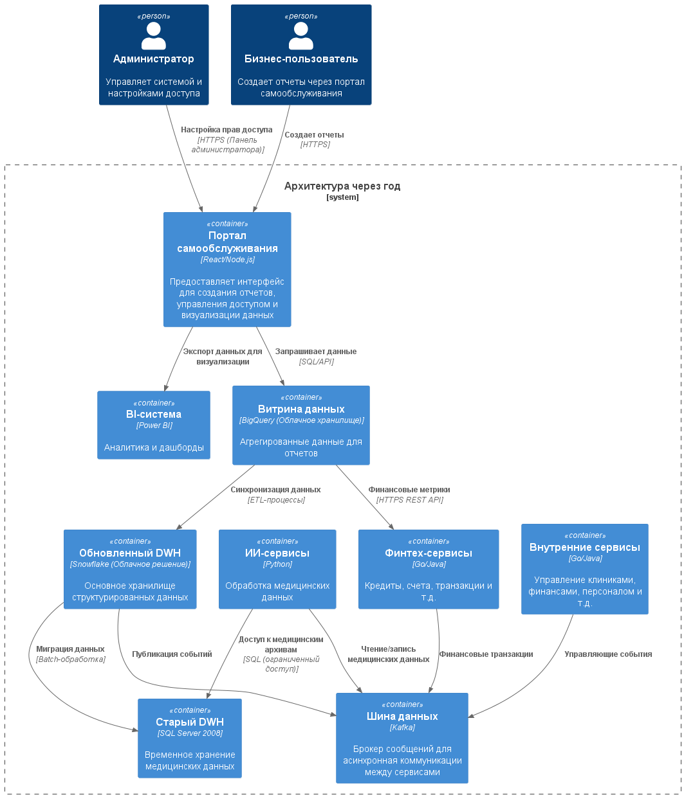

# Задание 1

Ниже приводится выполнение пунктов задания 1. Описание идет в логическом порядке от проблемы к решению.

## Проблемные места текущей архитектуры

- Устаревшие технологии:
  - **DWH на SQL Server 2008**(Высокий приоритет):
    - Низкая производительность при обработке сотен терабайт данных;
    - Отсутствие поддержки современных функций (например, горизонтальное масштабирование, индексация для аналитических запросов);
  - **Power Builder**(Средний приоритет):
    - Устаревший интерфейс для операторов клиник, сложность интеграции с новыми системами;
  - **Apache Camel**(Высокий приоритет):
    - Не справляется с асинхронной обработкой данных от новых бизнесов (фармацевтика, электроника);
    - Отсутствие поддержки событийно-ориентированной архитектуры;
- Медленная генерация отчетов (Низкий приоритет);
- Все сервисы зависят от DWH (Средний приоритет).

## Архитектура системы через год

Ниже показана архитектура системы "Будущее 2.0" через год.

1. **Портал самообслуживания** — Центральный интерфейс для пользователей. Интегрируется с витриной данных и BI-системой.
2. **Витрина данных** — Содержит только данные, разрешенные для аналитики, без медицинских исследований. Обновляется через ETL из DWH.
3. **Обновленный DWH** — Облачное решение Snowflake для масштабируемости и скорости обработки.
4. **Шина данных (Kafka)** — заменяет устаревшую шину на Apache Camel. Обеспечивает асинхронное взаимодействие между сервисами.
5. **Старый DWH** — Временно сохраняется для медицинских данных, недоступных для аналитики. Постепенно заменяется.
6. **ИИ-сервисы** — Изолированы в контейнерах для работы с медицинскими данными. Взаимодействуют через шину данных.
7. **Финтех-сервисы** — Микросервисы на для независимого развития банковского направления.
8. **BI-система** — Power BI или аналоги для визуализации.
