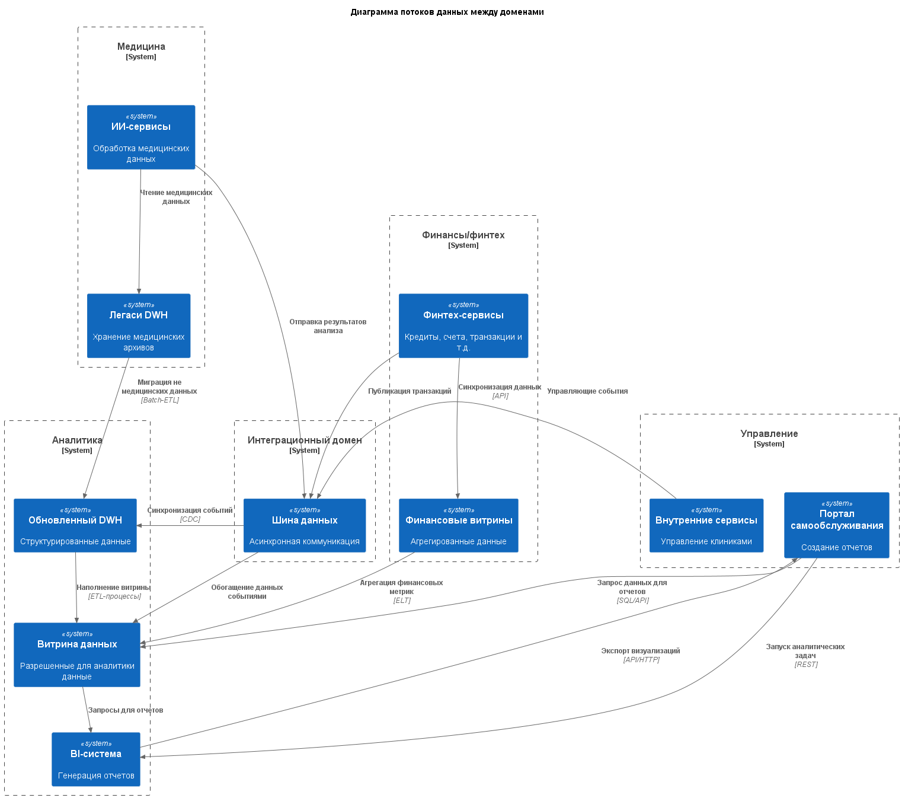

# Задание 2

## Домены системы "Будущее 2.0"

Ниже выделяются следующие доменные области для системы "Будущее 2.0":

- **Медицина** - Домен отвечает за работу с медицинскими данными. В него входят:
    - ИИ-сервисы: Обработка медицинских данных и снимков.
    - Старый DWH: Временно хранит медицинские архивы;
- **Финансы/финтех** - Охватывает сервисы по управление финансовыми операциями. В него входят:
    - Финансовые сервисы;
- **Аналитика** - Аналитика и визуализация данных, создание различных отчетов. В него входят:
    - Витрина данных - содержит только разрешенные для аналитики данные;
    - BI-система;
    - Обновленный DWH.
- **Управление** - Охватывает внутренние процессы, не связанные напрямую с аналитикой. В домен входят:
    - Внутренние сервисы;
    - Портал самообслуживания;
- **Интеграционный домен** - В него входит шина данных Kafka.

Такое разбиение на домены позволит сделать компоненты системы более независимыми друг от друга, что повышает надежность, безопасность, упрощает дальнейшее развитие компонентов системы и упрощает масштабируемость различных компонентов системы. Шина данных позволит безболезненно подключать новые домены.
Каждый домен отвечает за свои данные и витрины. Витрина данных служит единым источником для кросс-доменной аналитики.

Так же такое разбиение на домены изолирует медицинские данные отдельно от аналитики, а финансовые данные изолируются и не управляются в DWH.

## Потоки данных между доменами

Ниже показана диаграмма потоков данных между доменами, которые описаны в предыдущем разделе.

